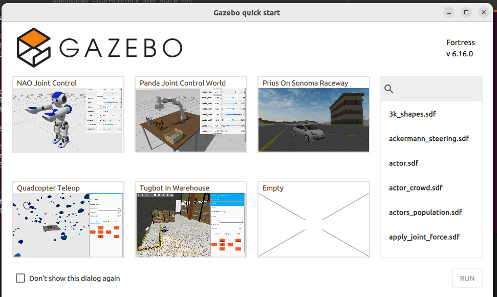
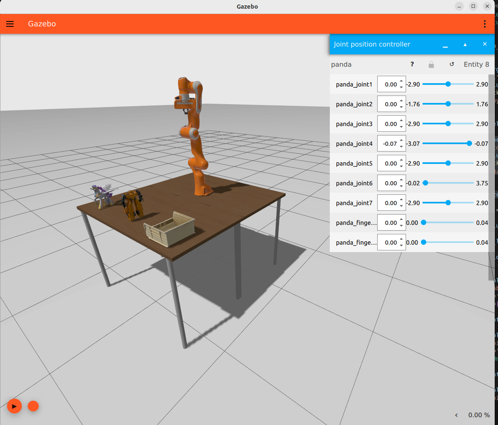

## 1. Getting started with ROS2 and myCobot with Webots simulator

### Prerequisites
TODO

### 1.1 Based on
1. [mycobot_ros2 tutorial](https://github.com/automaticaddison/mycobot_ros2)
2. [automaticaddison tutorials myCobot 280](https://automaticaddison.com/tutorials/)

### 1.2 Steps to build
<detail closed>
  <summary>
    TODO
  </summary>
</details>


### Know-how
- Extensions for VSC: Microsoft ROS extension, XML Redhat, python, autoDocstring, 
- URDF stored in package `mycobot_description` (see [this](https://automaticaddison.com/how-to-model-a-robotic-arm-with-a-urdf-file-ros-2/))
- [Naming and organizing projects](https://automaticaddison.com/naming-and-organizing-packages-in-large-ros-2-projects/)
  - Based on [best practice](https://ros.org/reps/rep-0144.html)
  - Suffix for purpose of the package `_description` 
    - URDF file and mesh files
  - [metapackage](https://wiki.ros.org/Metapackages), list of dependencies to other packages. (name of roboto `my_cobot`)
  - One package one purpose
- `xacro` files in `_description`
  - blueprints for [URDF](https://automaticaddison.com/how-to-load-a-urdf-file-into-rviz-ros-2/) files
  - using macros and variables to simplify complex robot descriptions.
  - Before a ROS tool or component can use the information in a XACRO file, it must first be processed (translated) into a URDF file. This step allows for the dynamic generation of robot    descriptions based on the specific configurations defined in the XACRO file. (/meshes)
    - Mesh files are used to visually represent the geometric shape of the robot parts in simulations and visualizations.
      These files are typically in formats such as `STL` (Stereo Lithography – .stl) or `COLLADA` (.dae).
    - Mesh files define the 3D shapes of components such as links,
      which are visualized in tools like [RViz (ROS visualization tool)](https://automaticaddison.com/how-to-load-a-urdf-file-into-rviz-ros-2/)
      and [Gazebo (a robot simulation environment)](https://automaticaddison.com/how-to-simulate-a-robot-using-gazebo-and-ros-2/).
      TODOs ^
    - 
#### Visualize
- To visualize URDF file in RVIS
  - red - x, green - y, blue - z
```bash
$ sudo apt-get install ros-${ROS_DISTRO}-urdf-tutorial
# Can be .xacro or .urdf file
$ ros2 launch urdf_tutorial display.launch.py model:=/home/ubuntu/ros2_ws/src/mycobot_ros2/mycobot_description/urdf/mycobot_280_urdf.xacro
$ ros2 launch urdf_tutorial display.launch.py model:=/home/anel/GitHub/pick_and_place_ros/anel_ws/mycobot_ros2_description/urdf/mycobot_320_m5_2022.urdf
```
- Check coordinate frames (.pdf will be created)
```bash
$ ros2 run tf2_tools view_frame
# gnome document viewer
$ evince frames_2024-10-13_11.01.53.pdf 
```

#### Launch file
- [Based on this](https://automaticaddison.com/create-a-launch-file-for-a-simulated-robotic-arm-ros-2/)
```bash
$ mkdir anel_ws/mycobot_ros2_description/launch
$ gedit mycobot320.launch.py
$ mkdir anel_ws/mycobot_ros2_description/rviz
```
- Add to `setup.py`
```python
        ("share/" + package_name + "/urdf", glob("urdf/*")),
        ("share/" + package_name + "/launch", glob("launch/*")),
        ("share/" + package_name + "/rviz", glob("rviz/*")),
```
- As result these filese will be built with `colcon build` in `install` directory
```bash
$ find install/ |grep -e rviz -e urdf -e launch
./install/mycobot_ros2_description/share/mycobot_ros2_description/launch/mycobot320.launch.py
./install/mycobot_ros2_description/share/mycobot_ros2_description/urdf/mycobot_320_m5_2022.urdf
./install/mycobot_ros2_description/share/mycobot_ros2_description/urdf/mycobot_320_m5_2022.urdf
```
- To launch it 
```bash
$ ros2 launch mycobot_ros2_description mycobot320.launch.py
```

- Error becaues of wrong setup
```bash
$ ros2 launch mycobot_ros2_description mycobot320.launch.py
file 'mycobot320.launch.py' was found more than once in the share directory of package 'mycobot_ros2_description': ['/home/anel/GitHub/pick_and_place_ros/anel_ws/install/mycobot_ros2_description/share/mycobot_ros2_description/mycobot320.launch.py', '/home/anel/GitHub/pick_and_place_ros/anel_ws/install/mycobot_ros2_description/share/mycobot_ros2_description/launch/mycobot320.launch.py']
```

Solution: Remove `build` directory  and start `colcon build`


### Simulate robotic arm in Gazebo and Ros2
[based on this](https://automaticaddison.com/how-to-simulate-a-robotic-arm-in-gazebo-ros-2/)
- There are 2 ways
1. classic way - `gazebo`
2. new way (ignition) - `ros_gz`

#### DAE
DAE (Digital Asset Exchange) files, also known as COLLADA (COLLAborative Design Activity) files, can be created by various 3D modeling and animation software
The DAE format is widely used in game development, virtual reality, augmented reality, and simulation environments because it’s an open standard that can store 3D assets along with their associated metadata.
AWS RoboMaker

#### Gazebo ignition
- Worlds
  - in `worlds` folder
  - simulated world using the Simulation Description Format (SDF) 
  - Plugins used:
    - Physics - how objects interact and move in the world.
    - UserCommands -  to control things in the simulation
    - SceneBroadcaster - updates about what’s happening in the world.
  - `Models` are inserted from outside sources
    - `Sun`
- Models
  - allows the simulation to efficiently handle both the physical interactions and visual representation 
  - type `static` - not moving
  - each model is folder in `models` folder
  - is defined using the Simulation Description Format (SDF)
  - Each model contains of `links` that has components
    - `inertial` - how object behaves in physics
    - `collission` - shape used for collission detection - mesh file `.dae` in `models/<model>/meshes` directory
    - `visual geometry` - how model looks in the simulation - separate mesh file `.dae`
    - `model.sdf` and `model.config` files are typically created manually using a basic text editor.
- URDF settings
  - in `urdf` folder
- List of [Gazebo plugins](https://gazebosim.org/api/sim/8/namespacegz_1_1sim_1_1systems.html)
  - The JointStatePublisher publishes the state of all joints in a robot to the “/joint_states” topic, including positions (radians or meters), velocities (radians per second or meters per second), and efforts (Nm or N) as a sensor_msgs/JointState message.
  - The JointPositionController subscribes to target joint angles (i.e. positions) as a std_msgs/Float64 message (i.e. a floating-point number like 0.36).

- [ros2 controllers](https://control.ros.org/rolling/doc/ros2_controllers/doc/controllers_index.html)

- **Flow**
 - Based on [image](https://automaticaddison.com/how-to-simulate-a-robotic-arm-in-gazebo-ros-2/) `ros_2 control` package has
 1. Controller Manager -> speaks with app and resource manager (`ros2_control` package)
   - `arm_controller` - picks/subscribes to `velocity` and `position` from Simulation/Arm HW interface
   - `status_broadcaster` - Get status from Simulation/Arm HW interface adn report/publish to `joint_states` topic
   - `tool_controller` - gets position from gripper
 2. Resource Manager - speaks with controller manager and simulation/real system
   - Simulation HW interface - Gazebo
   - Arm HW interface -  real world
   - Tool HW interface
   - ros2`arm_controller`

- Setting up the parameter file to enable ros to speak with gazebo [see this](https://gazebosim.org/docs/fortress/ros2_interop/) and [integration](https://gazebosim.org/docs/fortress/ros2_integration/)

<details closed>
  <summary>
   Ros 2 integration
  </summary>

```bash
$ ros2 run ros_gz_bridge parameter_bridge /TOPIC@ROS_MSG@IGN_MSG
```
- Means `ros2 run ros_gz_bridge parameter_bridge` - runs `parameter_bridge` code from the `ros_gz_bridge` package
- `/TOPIC` - Ignition internal topic, over which the messages will be sent.
- 1. `@` - ROS_msg type
- 2. Here can be `@` (bidirectional), `[` (from ignition to ros) or `]` (from ros to ignition) - ign_msg type
- ALternatively there is `ros_ign_bridge` launch file to specify yaml format

- Example of ros integration
```bash
# Bridge where Key publisher plugin sends messages
$ ros2 run ros_gz_bridge parameter_bridge /keyboard/keypress@std_msgs/msg/Int32@ignition.msgs.Int32
# Add top right conernr `key publisher` plugin
$ ign gazebo empty.sdf
# Listener (after pressing keyboard in gazebo)
$ ros2 topic echo /keyboard/keypress
data: 83
---
```
</details>


<details closed>
  <summary>
   Ros 2 interoperability
  </summary>

- Based on [this](https://gazebosim.org/docs/fortress/ros2_interop/)
- Example `rrobt` arm.
</details>


<details closed>
  <summary>
    Getting started with Gazebo ignition
  </summary>

- Example of starting gazebo

```bash
$ sudo apt-get install ros-${ROS_DISTRO}-ros-gz
# if for some reason it doesn't start kill process
$ kill -9 `pgrep -x 'ruby'`
$ ign gazebo empty.sdf
# For some reasaon this sometimes doesn't work
$ ros2 launch ros_gz_sim gz_sim.launch.py gz_args:="shapes.sdf"
# This works
$ ros2 launch ros_gz_sim gz_sim.launch.py
# There is an error
[ruby $(which ign) gazebo-1] Xlib:  extension "NV-GLX" missing on display ":1".
[ruby $(which ign) gazebo-1] [Err] [SystemPaths.cc:473] Could not resolve file [texture.png]
```


</details>


### Control robotic arm using ros2 control and gazebo
https://automaticaddison.com/how-to-control-a-robotic-arm-using-ros-2-control-and-gazebo/

### Control robotic arm using ros2 control and gazebo
https://automaticaddison.com/how-to-control-a-robotic-arm-using-ros-2-control-and-gazebo/


## Mycobot 320 URDF file create
<detail closed>
  <summary>
    Practice - problem with generating - not important will use URDF
  </summary>

```bash
# URDF files package
$ ros2 pkg create --build-type ament_python --license Apache-2.0 --description &quot;mycobot ros2 URDF files, mesh files&quot; mycobot_ros2_description
# based package (metadata) exec depends on _description package (see package.xml)
$ ros2 pkg create --build-type ament_python --license Apache-2.0 --description "mycobot ros2 anel" mycobot_ros2 --dependencies mycobot_ros2_description
# Build
$ colcon build
$ source ./install/setup.sh
# Check
$ ros2pkg |grep mycobot_ros2
mycobot_ros2
mycobot_ros2_description

# Create URDF file
$ mkdir mycobot_ros2_description/mycobot_ros2_description/urdf
$ touch mycobot_ros2_description/mycobot_ros2_description/mycobot_320_urdf.xacro
$ mkdir -p mycobot_ros2_description/mycobot_ros2_description/meshes/mycobot_320
$ git clone https://github.com/elephantrobotics/mycobot_ros2/tree/humble/mycobot_description/urdf/mycobot_320_m5_2022
$ ll ../ros2_ws/src/mycobot_ros2/mycobot_description/urdf/mycobot_320_m5_2022/
total 29064
drwxrwxr-x  2 anel anel     4096 Oct  5 15:52 ./
drwxrwxr-x 20 anel anel     4096 Oct  5 15:52 ../
-rwxrwxr-x  1 anel anel 14544765 Oct  5 15:52 base.dae*
-rwxrwxr-x  1 anel anel  2456810 Oct  5 15:52 link1.dae*
-rwxrwxr-x  1 anel anel  3525724 Oct  5 15:52 link2.dae*
-rwxrwxr-x  1 anel anel  4088651 Oct  5 15:52 link3.dae*
-rwxrwxr-x  1 anel anel  2160196 Oct  5 15:52 link4.dae*
-rwxrwxr-x  1 anel anel  2526859 Oct  5 15:52 link5.dae*
-rwxrwxr-x  1 anel anel   408646 Oct  5 15:52 link6.dae*
-rw-rw-r--  1 anel anel     5091 Oct  5 15:52 mycobot_320_m5_2022.urdf

$  cp -r ../ros2_ws/src/mycobot_ros2/mycobot_description/urdf/mycobot_320_m5_2022/ mycobot_ros2_description/mycobot_ros2_description/meshes/
# They should be in parent folder
$ mv mycobot_ros2_description/mycobot_ros2_description/urdf/ mycobot_ros2_description/
$ mv mycobot_ros2_description/mycobot_ros2_description/meshes/ mycobot_ros2_description/
# Create xacro file in urdf folder
$ touch ./urdf/mycobot_320.xacro

# Visualise URDF
$  sudo apt-get install ros-humble-urdf-tutorial

# Change
# <mesh filename="file://$(find mycobot_ros2_description)/meshes/mycobot_320_m5_2022/base.dae"/>
# to 
# <mesh filename="package://mycobot_ros2_description/meshes/mycobot_320_m5_2022/base.dae"/>
```
- We can find URDFs here [mycobot](https://github.com/elephantrobotics/mycobot_ros/tree/noetic/mycobot_description/urdf), or [mycobot ros2](https://github.com/elephantrobotics/mycobot_ros2/tree/humble/mycobot_description)


- Running `ros2 urdf_tutoril` not working
```bash
$ ros2 launch urdf_tutorial display.launch.py model:=/home/anel/GitHub/pick_and_place_ros/anel_ws/mycobot_ros2_description/urdf/mycobot_320.xacro 
```
- Mesh file doesn't exist in `share`
```bash
$ ls install/mycobot_ros2_description/share/
ament_index  colcon-core  mycobot_ros2_description
$ ls install/mycobot_ros2_description/share/mycobot_ros2_description/
hook  package.bash  package.dsv  package.ps1  package.sh  package.xml  package.zsh
```

- `chown -x *.dae && chown a+x *.dae`

</details>


Unofficial https://github.com/Tiryoh/mycobot_ros/tree/main
