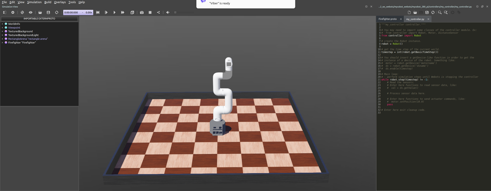

## 1. Getting started with ROS2 and myCobot with Webots simulator

### Prerequisites
- Make sure you have installed [ROS2](0_ros2_getting_started.md)
- Make sure that `underlay` workspace is properly sourced `source /opt/ros/humble/setup.bash`
- Make sure you have installed [Webots](webots/0_webots_getting_started.md)

### 1.1 Based on
1. [mycobot_webots](https://github.com/elephantrobotics/mycobot_webots)

### 1.2 Steps to build
<details>
  <summary>
    Create directory and start
  </summary>

  - Get the directory
    ```bash
    $  mkdir ros2_ws_webots && cd ros2_ws_webots
    $ git clone https://github.com/elephantrobotics/mycobot_webots.git
    $ $ ll mycobot_webots/
    total 32
    drwxrwxr-x 7 anel anel 4096 Oct  7 11:19 ./
    drwxrwxr-x 3 anel anel 4096 Oct  7 11:19 ../
    drwxrwxr-x 8 anel anel 4096 Oct  7 11:19 .git/
    drwxrwxr-x 6 anel anel 4096 Oct  7 11:19 mercury_a1/
    drwxrwxr-x 6 anel anel 4096 Oct  7 11:19 mercury_b1/
    drwxrwxr-x 6 anel anel 4096 Oct  7 11:19 mycobot_280_pi/
    -rw-rw-r-- 1 anel anel 1074 Oct  7 11:19 README.md
    drwxrwxr-x 2 anel anel 4096 Oct  7 11:19 res/
    ```
  - Start the `webots`
    ```bash
    $ webots
    ```
  - Load the `world` file from `webots` GUI: `File -> Open World` and choose `mycobot_webots/mycobot_280_pi/worlds/mycobot_280_pi.wbt`
  - We must get the following
  
</details>


### 2. Create custom package and use on mycobot
TODO

### 2. Troubleshooting

#### 2.1 Opening the world file
- When `webot` starts and world file from `mycobot` is used, robot will fail, with errors

  <details>
    <summary>
      Error while starting the webots with world file
    </summary>

    ```bash
    INFO: my_controller: Starting controller: python3 -u my_controller.py
    WARNING: Contact joints between materials 'default' and 'default' will only be created for the 10 deepest contact points instead of all the 26685 contact points.
    WARNING: The current physics step could not be computed correctly. Your world may be too complex. If this problem persists, try simplifying your bounding object(s), reducing the number of joints, or reducing WorldInfo.basicTimeStep.
    WARNING: The current physics step could not be computed correctly. Your world may be too complex. If this problem persists, try simplifying your bounding object(s), reducing the number of joints, or reducing WorldInfo.basicTimeStep.
    WARNING: Contact joints between materials 'default' and 'default' will only be created for the 10 deepest contact points instead of all the 34464 contact points.
    WARNING: The current physics step could not be computed correctly. Your world may be too complex. If this problem persists, try simplifying your bounding object(s), reducing the number of joints, or reducing WorldInfo.basicTimeStep.
    WARNING: Contact joints between materials 'default' and 'default' will only be created for the 10 deepest contact points instead of all the 76 contact points.
    WARNING: The current physics step could not be computed correctly. Your world may be too complex. If this problem persists, try simplifying your bounding object(s), reducing the number of joints, or reducing WorldInfo.basicTimeStep.
    WARNING: The current physics step could not be computed correctly. Your world may be too complex. If this problem persists, try simplifying your bounding object(s), reducing the number of joints, or reducing WorldInfo.basicTimeStep.
    WARNING: Contact joints between materials 'default' and 'default' will only be created for the 10 deepest contact points instead of all the 44 contact points.
    WARNING: The current physics step could not be computed correctly. Your world may be too complex. If this problem persists, try simplifying your bounding object(s), reducing the number of joints, or reducing WorldInfo.basicTimeStep.
    WARNING: Contact joints between materials 'default' and 'default' will only be created for the 10 deepest contact points instead of all the 11446 contact points.
    WARNING: Contact joints between materials 'default' and 'default' will only be created for the 10 deepest contact points instead of all the 65 contact points.
    WARNING: The current physics step could not be computed correctly. Your world may be too complex. If this problem persists, try simplifying your bounding object(s), reducing the number of joints, or reducing WorldInfo.basicTimeStep.
    WARNING: The current physics step could not be computed correctly. Your world may be too complex. If this problem persists, try simplifying your bounding object(s), reducing the number of joints, or reducing WorldInfo.basicTimeStep.
    WARNING: Contact joints between materials 'default' and 'default' will only be created for the 10 deepest contact points instead of all the 93 contact points.
    WARNING: Contact joints between materials 'default' and 'default' will only be created for the 10 deepest contact points instead of all the 12 contact points.
    WARNING: Contact joints between materials 'default' and 'default' will only be created for the 10 deepest contact points instead of all the 12 contact points.
    WARNING: Contact joints between materials 'default' and 'default' will only be created for the 10 deepest contact points instead of all the 12 contact points.
    ```
  </details>

- **FIX**
  - To fix the issue `Pause` and `Reset Simulation` (restore to initial state) or `Tools->Preferences->General->Startup mode` and choose `Pause` over `Real time`

## TODO 🛠️
- TODO for later
- Eveything else is blocked since there is no way to simulate interface (no `launch` file between ROS2 and Webots). 
  - Options:
  1. Use `ubuntu 20.4` (`ROS1`) - issue: VM settings
  2. Use `ROS2` and `Gazebo` - issue: learning `Gazebo`
  3. Postpone this scope and switch to [Scope 2 (`NVIDIA Isaac`)](#scope2)