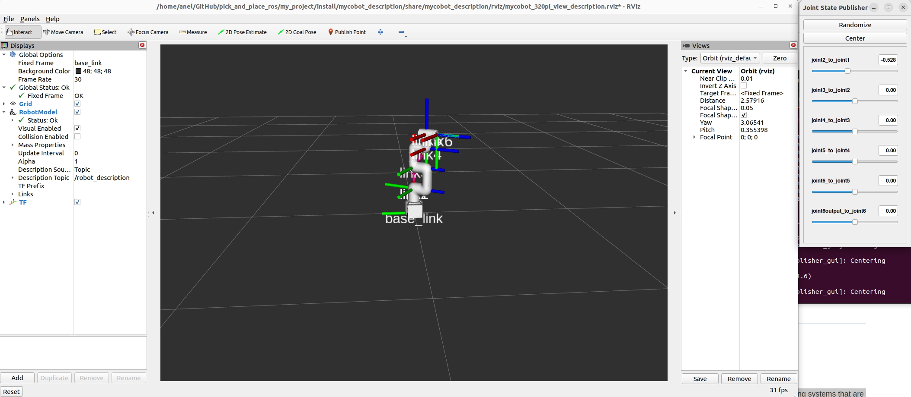
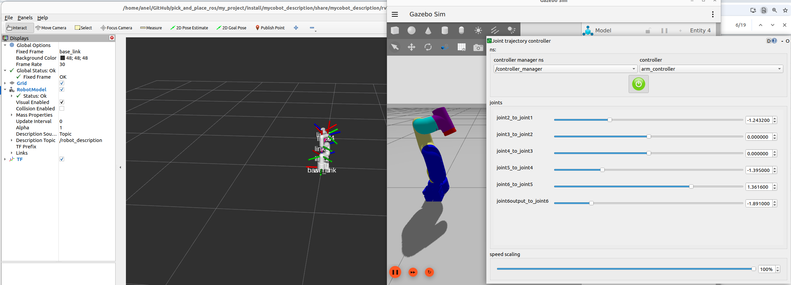

# Project
- Pick and place project with Elephant robot in ROS

# System
- Ubuntu `jammy` 22.04
- ROS2  (Iron LTS)
- Gazebo Harmonic (Gazebo 8) (LTS)
- Elephant mycobo_320_pi

# Scope 1
Tasks that will be done
1. <span style="color:green;">Getting started with ROS2 and myCobot</span>
2. Create environment of 3 objects (hammer 🔨, screwdriver 🪛 and scissors ✂️) 
3. Use camera at the top and capture pictures
4. Implement CNN
5. Integrate CNN with rule based algorithm
6. DRL


## 🟢 1. Start robot 
- Make sure you followed [installation procedure]((1_getting_started_with_ros2_and_mycobot320.md))
- To start our robot from `my_project` directory
```bash
$ sudo apt install git
$ git clone git@github.com:aheacon/pick_and_place_ros.git # or Download as Zip
$ cd pick_and_place_ros/my_project
# Do this before every change
$ rm -rf build/ install/ log/
# $ rosdep install --from-paths src --ignore-src -r -y # don't do this since it will install ignition gazebo for Iron ROS2
$ colcon build
Summary: 1 package finished [1.35s]
$ source install/setup.bash
```
- Check `Rviz` visualisator
```bash
$ ros2 launch mycobot_description mycobot_320pi.launch.py
```
  - One should get this picture
  
  - To stop any process by force run
  ```bash
  $ kill -9 `pgrep -x 'rviz2'`
  ```
- Check `Gazebo` simulator
```bash
$ ros2 launch mycobot_description gazebo_mycobot_320pi.launch.py
```
### Run manually
  - Use the `joint` positions to navigate robot from GUI
  - Alternatively use following commands from terminal
  ```bash
  # Move robot to desired position
  $ ros2 topic pub \
    arm_controller/joint_trajectory\
    trajectory_msgs/msg/JointTrajectory\
    "{joint_names:['joint2_to_joint1', 'joint3_to_joint2', 'joint4_to_joint3', 'joint5_to_joint4', 'joint6_to_joint5', 'joint6output_to_joint6'], points: [{positions: [-1,1,-1,-2,0.5,0], time_from_start: {sec: 0, nanosec: 0}}]}"

  # Move it back on original position
  $ ros2 topic pub \
    arm_controller/joint_trajectory\
    trajectory_msgs/msg/JointTrajectory\
    "{joint_names:['joint2_to_joint1', 'joint3_to_joint2', 'joint4_to_joint3', 'joint5_to_joint4', 'joint6_to_joint5', 'joint6output_to_joint6'], points: [{positions: [0,0,0,0,0,0], time_from_start: {sec: 0, nanosec: 0}}]}"
  ```
  - One should obtain the following picture
  
### Run using action server and client
- Run the script
```
$ ros2 run mycobot_description example_joint_publisher 
```

### Stop everything
- To stop `Gazebo` (and other programs) by force
```bash
$ kill -9 `pgrep -x 'ruby'`
```

## Tutorials
- Refer to [Getting started with ROS2 and myCobot 320](1_getting_started_with_ros2_and_mycobot320.md) (**done** ✅)
- Refer to [Getting started with ROS2 and myCobot with Gazebo simulator](2_getting_started_with_mycobot_gazebo.md)(**done** ✅)
- Refer to [Getting started with ROS2 and myCobot with Webots simulator](3_getting_started_with_mycobot_webots.md) (**for later** 🛠️)

# <a name="scope2"></a>Scope 2
### Blockers :x:
1. Getting started with `NVIDIA Isaac Sim` (**currently cannot be done on my hardware**:x:)
  - Needs better GPU and Isaac Sim is not rendering


