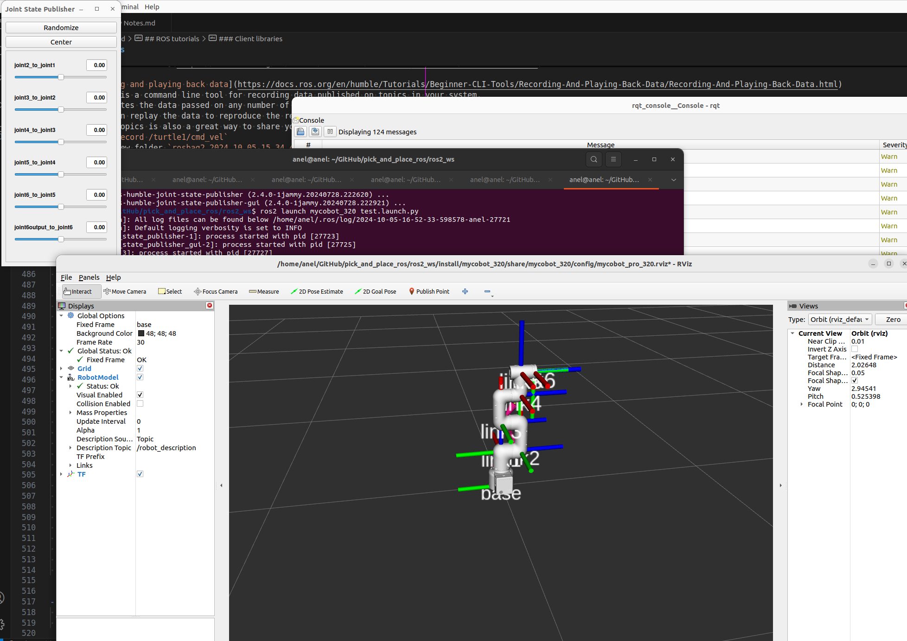

# Project
- Pick and place project with Elephant robot in ROS

# System
- Ubuntu `jammy` 22.04
- ROS2  (Humble LTS)
- Elephant 320

# Scope
Tasks that will be done
1. Getting started with ROS2 and myCobot 320 (**done** ✅)
2. Create environment of 3 objects (hammer 🔨, screwdriver 🪛 and scissors ✂️) (**in progress** 🔴 )
3. Use camera at the top and capture pictures
4. Implement CNN
5. Integrate CNN with rule based algorithm
6. DRL


## 1. Getting started with ROS2 and myCobot

### 1.1 Based on
1. [mycobot ros2 tutorial](https://docs.elephantrobotics.com/docs/gitbook-en/12-ApplicationBaseROS/12.2-ROS2/12.2.1-ROS2%E7%9A%84%E5%AE%89%E8%A3%85.html)
2. [mycobot_ros2 GitHub](https://github.com/elephantrobotics/mycobot_ros2)
3. [myCobot YT](https://www.youtube.com/watch?v=-Jo_IJ8RaXc)
4. [GitBook myCobot](https://docs.elephantrobotics.com/docs/gitbook-en/)
5. [myCobot Isaac Gym](https://www.hackster.io/Elephant-Robotics-Official/mycobot-gripping-task-reinforcement-learning-with-isaac-gym-5621db)

### 1.2 Steps to build
- Make sure you have installed ROS2
- Make sure that `underlay` workspace is properly sourced `source /opt/ros/humble/setup.bash`
- Make sure you have installed `sudo apt install ros-humble-joint-state-publisher-gui`
```bash
$ mkdir -p ros2_ws/src
$ cd ros2_ws/src
$ git clone https://github.com/elephantrobotics/mycobot_ros2 -b humble --depth 1
$ cd ..
# there is no resdep files (see `Optional and troubleshooting`)
```
- Build package (from `package.xml`) with all its dependency and show console output while building
- Alternative to create `COLCON_IGNORE` file in the directory to skip building of specific package (didn't test this)
```bash
# Build target package
$ colcon build --packages-up-to mycobot_320 --event-handlers console_direct+
```

  <details closed>
  <summary> Result of build </summary>
  <br>

  ```bash
  # Output
  Installing camera_display script to /home/anel/GitHub/pick_and_place_ros/ros2_ws/install/mycobot_320/lib/mycobot_320
  Installing detect_marker script to /home/anel/GitHub/pick_and_place_ros/ros2_ws/install/mycobot_320/lib/mycobot_320
  Installing follow_display script to /home/anel/GitHub/pick_and_place_ros/ros2_ws/install/mycobot_320/lib/mycobot_320
  Installing following_marker script to /home/anel/GitHub/pick_and_place_ros/ros2_ws/install/mycobot_320/lib/mycobot_320
  Installing listen_real script to /home/anel/GitHub/pick_and_place_ros/ros2_ws/install/mycobot_320/lib/mycobot_320
  Installing listen_real_of_topic script to /home/anel/GitHub/pick_and_place_ros/ros2_ws/install/mycobot_320/lib/mycobot_320
  Installing opencv_camera script to /home/anel/GitHub/pick_and_place_ros/ros2_ws/install/mycobot_320/lib/mycobot_320
  Installing simple_gui script to /home/anel/GitHub/pick_and_place_ros/ros2_ws/install/mycobot_320/lib/mycobot_320
  Installing slider_control script to /home/anel/GitHub/pick_and_place_ros/ros2_ws/install/mycobot_320/lib/mycobot_320
  Installing teleop_keyboard script to /home/anel/GitHub/pick_and_place_ros/ros2_ws/install/mycobot_320/lib/mycobot_320
  writing list of installed files to '/home/anel/GitHub/pick_and_place_ros/ros2_ws/build/mycobot_320/install.log'
  Finished <<< mycobot_320 [1.03s]           

  Summary: 4 packages finished [10.9s]

  # Check directories
  $ ll
  total 24
  drwxrwxr-x 6 anel anel 4096 Oct  5 16:21 ./
  drwxrwxr-x 4 anel anel 4096 Oct  5 15:50 ../
  drwxrwxr-x 6 anel anel 4096 Oct  5 16:22 build/
  drwxrwxr-x 6 anel anel 4096 Oct  5 16:22 install/
  drwxrwxr-x 3 anel anel 4096 Oct  5 16:21 log/
  drwxrwxr-x 3 anel anel 4096 Oct  5 15:51 src/
  ```
  </details>


- Install `mycobot` dependency
```bash
$ pip install pymycobot --upgrade
# Successfully installed msgpack-1.0.8 packaging-24.1 pymycobot-3.5.3 pyserial-3.5 python-can-4.4.2 wrapt-1.16.0
```
- Source `overlay` (and add it to `~/.bashrc`) to configure ROS2 environment
```bash
$ source install/setup.bash
```

### 1.3 Start robot
- To start the robot, execute launch file
```bash
$ ros2 launch mycobot_320 test.launch.py
```

- To visiualize the robot start `rviz2`
```bash
$ rviz2
```

#### 1.3.1 Results
<details closed>
<summary> Result picture of launching the robot </summary>
<br>


</details>

<details closed>
<summary> Result log of launching the robot </summary>
<br>

```bash
$ ros2 launch mycobot_320 test.launch.py
[INFO] [launch]: All log files can be found below /home/anel/.ros/log/2024-10-05-16-52-33-598578-anel-27721
[INFO] [launch]: Default logging verbosity is set to INFO
[INFO] [robot_state_publisher-1]: process started with pid [27723]
[INFO] [joint_state_publisher_gui-2]: process started with pid [27725]
[INFO] [rviz2-3]: process started with pid [27727]
[robot_state_publisher-1] [INFO] [1728139953.868858638] [robot_state_publisher]: got segment base
[robot_state_publisher-1] [INFO] [1728139953.868971142] [robot_state_publisher]: got segment link1
[robot_state_publisher-1] [INFO] [1728139953.868985669] [robot_state_publisher]: got segment link2
[robot_state_publisher-1] [INFO] [1728139953.868999516] [robot_state_publisher]: got segment link3
[robot_state_publisher-1] [INFO] [1728139953.869009174] [robot_state_publisher]: got segment link4
[robot_state_publisher-1] [INFO] [1728139953.869019614] [robot_state_publisher]: got segment link5
[robot_state_publisher-1] [INFO] [1728139953.869027940] [robot_state_publisher]: got segment link6
[rviz2-3] [INFO] [1728139954.542204804] [rviz2]: Stereo is NOT SUPPORTED
[rviz2-3] [INFO] [1728139954.542377282] [rviz2]: OpenGl version: 4.6 (GLSL 4.6)
[rviz2-3] [INFO] [1728139954.613967999] [rviz2]: Stereo is NOT SUPPORTED
[joint_state_publisher_gui-2] [INFO] [1728139954.786821033] [joint_state_publisher]: Waiting for robot_description to be published on the robot_description topic...
[joint_state_publisher_gui-2] [INFO] [1728139954.798732051] [joint_state_publisher]: Centering
[joint_state_publisher_gui-2] [INFO] [1728139954.884827043] [joint_state_publisher]: Centering
```
</details>


### 1.4 Real robot connection 💁
- TODO 💁 for later
- Check [this](https://docs.elephantrobotics.com/docs/gitbook-en/12-ApplicationBaseROS/12.2-ROS2/12.2.4-rviz%E4%BB%8B%E7%BB%8D%E5%8F%8A%E4%BD%BF%E7%94%A8/) for serial connection 


## 2. Create environment of 3 objects (hammer 🔨, screwdriver 🪛 and scissors ✂️)
- **in progress** 🔴

# Other literature
[1] [ROS2 Humble tutorial](https://docs.ros.org/en/humble/Tutorials.html)

# Optional and troubleshooting

#### Rosdep missing  for mycobot
- This is step to check compatilbity before building (not needed for now).
```bash
$ rosdep install -i --from-path src --rosdistro humble -y
ERROR: the following packages/stacks could not have their rosdep keys resolved
to system dependencies:
...
mycobot_280: Cannot locate rosdep definition for [actionlib]
mycobot_320: Cannot locate rosdep definition for [actionlib]
mycobot_320pi: Cannot locate rosdep definition for [actionlib]
...
```
- No fix needed

#### Launch file problem
```bash
$ ros2 launch mycobot_320 test.launch.py
[INFO] [launch]: All log files can be found below /home/anel/.ros/log/2024-10-05-16-49-37-621332-anel-27323
[INFO] [launch]: Default logging verbosity is set to INFO
[ERROR] [launch]: Caught exception in launch (see debug for traceback): "package 'joint_state_publisher_gui' not found, searching: ['/home/anel/GitHub/pick_and_place_ros/ros2_ws/install/mycobot_320', '/home/anel/GitHub/pick_and_place_ros/ros2_ws/install/mycobot_communication', '/home/anel/GitHub/pick_and_place_ros/ros2_ws/install/mycobot_interfaces', '/home/anel/GitHub/pick_and_place_ros/ros2_ws/install/mycobot_description', '/opt/ros/humble']"
```
- To fix it install package `sudo apt install ros-humble-joint-state-publisher-gui`