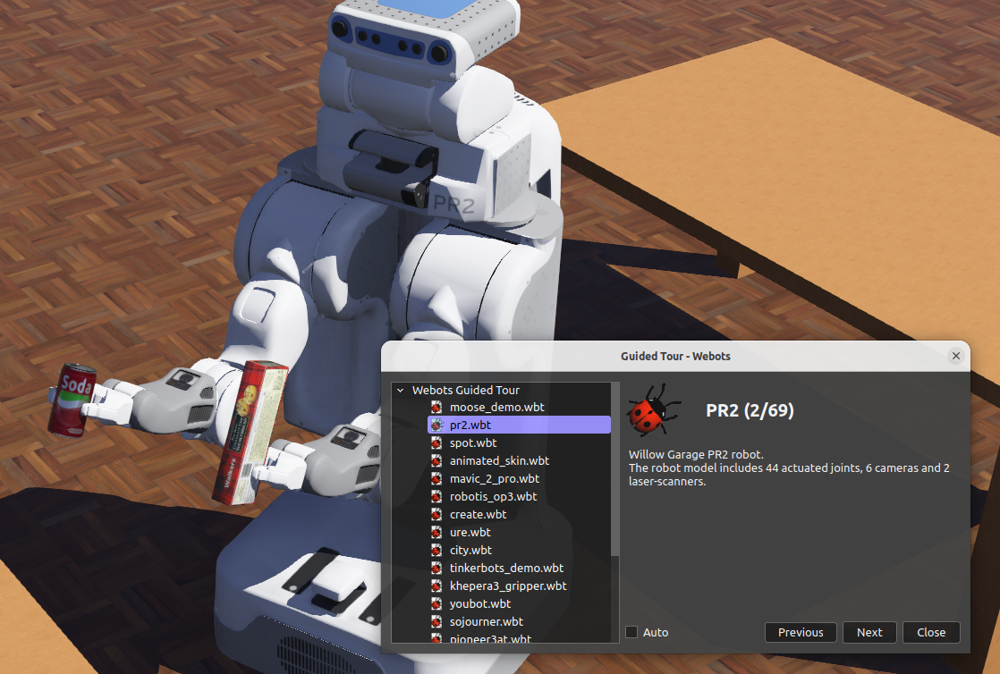
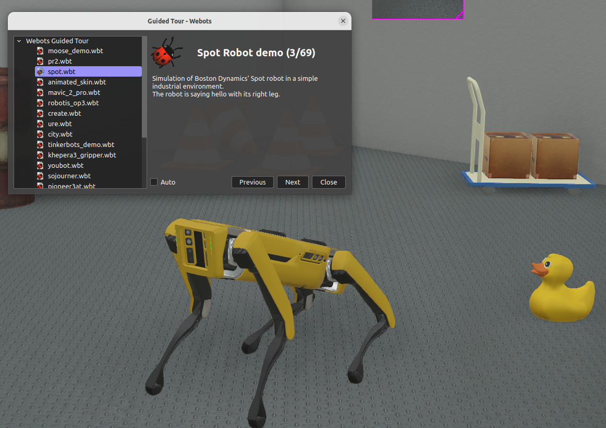
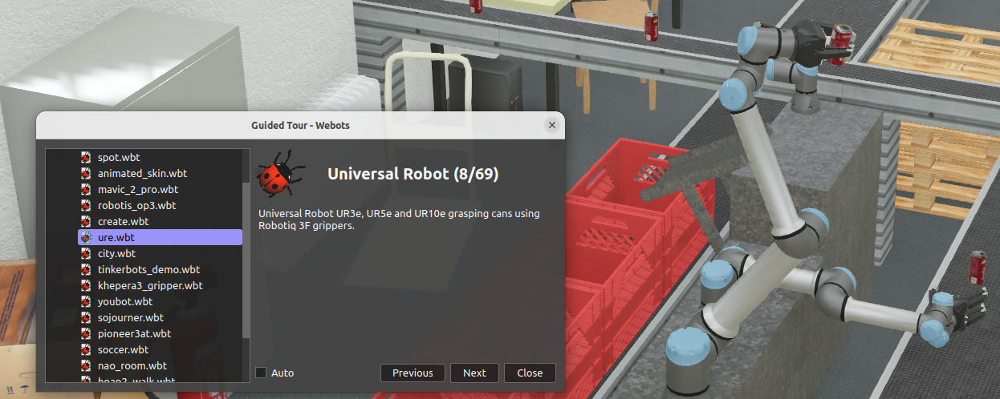
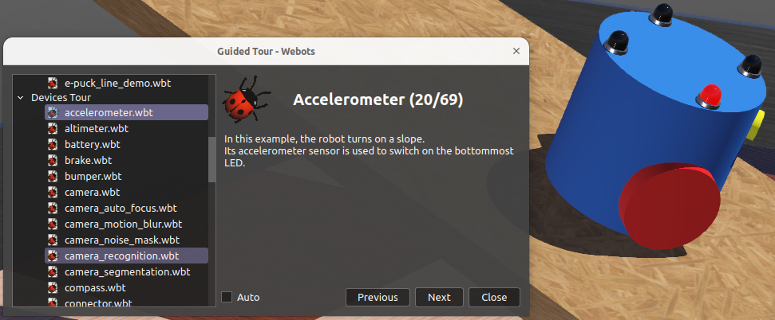

## WEBOTS tutorial

### 1 Based on
1. [tutorial](https://www.cyberbotics.com/doc/guide/tutorials)

### 2. My configuration
<details>
  <summary>
    Configuration
  </summary>

  ```bash
  # OS used
  $ lsb_release -rc
  Release:	22.04
  Codename:	jammy

  # glibc version (needed >= 2.11.1)
  $ ldd --version
  ldd (Ubuntu GLIBC 2.35-0ubuntu3.8) 2.35 
  ```
</details>

#### 2.1 Check the GPU driver on Linux
<details>
  <summary>
    Check the GPU driver on Linux
  </summary>

  ```bash
  $ sudo apt install mesa-utils
  $ glxinfo|grep OpenGL
  OpenGL vendor string: NVIDIA Corporation
  OpenGL renderer string: NVIDIA GeForce GTX 1060 6GB/PCIe/SSE2
  OpenGL core profile version string: 4.6.0 NVIDIA 535.183.01
  OpenGL core profile shading language version string: 4.60 NVIDIA
  OpenGL core profile context flags: (none)
  OpenGL core profile profile mask: core profile
  OpenGL core profile extensions:
  OpenGL version string: 4.6.0 NVIDIA 535.183.01
  OpenGL shading language version string: 4.60 NVIDIA
  OpenGL context flags: (none)
  OpenGL profile mask: (none)
  OpenGL extensions:
  OpenGL ES profile version string: OpenGL ES 3.2 NVIDIA 535.183.01
  OpenGL ES profile shading language version string: OpenGL ES GLSL ES 3.20
  OpenGL ES profile extensions:
  #  Hardware driver doesn't need to be changed
  $ lspci |grep VGA
  08:00.0 VGA compatible controller: NVIDIA Corporation GP106 [GeForce GTX 1060 6GB] (rev a1)
  ```
  **TODO: Linux: Disable Desktop Effects** - Hardware accelation tips
  - `compiz` desktop effects
  - See later [reddit](https://www.reddit.com/r/linux4noobs/comments/16r7bg1/compiz_on_ubuntu_2204_lts/)

</details>

### 3. Installation
#### 3.1 Install locally
- [GitHub webots releases](https://github.com/cyberbotics/webots/releases)
  - Latest release is from June 28, 2023 [R2023b](https://github.com/cyberbotics/webots/releases/tag/R2023b)
  - Installation from [amd.deb package](https://github.com/cyberbotics/webots/releases/download/R2023b/webots_2023b_amd64.deb)
  - Have used `apt` installation procedure, see [here](https://www.cyberbotics.com/doc/guide/installation-procedure?tab-language=python#installing-the-debian-package-with-the-advanced-packaging-tool-apt)
    - It is 456MB binary
    - Uses `ffmpeg libavcodec-extra ubuntu-restricted-extra` for MPEG-4 movies

#### 3.2 Install through containers (not used)
<details>
  <summary>
    Containerized applications (not used)
  </summary>

  #### Headless mode
  - Image with a X virtual framebuffer (`Xvfb`)
    - Based on [this](https://elementalselenium.com/tips/38-headless)
    ```
    Xvfb (short for X virtual framebuffer) is an in-memory display server forUNIX-like operating system (e.g., Linux). It enables you to run graphical applications without a display (e.g., browser tests on a CI server) while also having the ability to take screenshots.
    ```
  ```bash
  $ docker run -it cyberbotics/webots:latest
  $ docker image_docs
  cyberbotics/webots          latest    f23676c141a1   15 months ago   1.43GB
  # TODO in container
  # xvfb-run webots --stdout --stderr --batch --mode=realtime /path/to/your/world/file
  ```

  #### Container with GUI and GPU accelaration
  - [TODO](https://www.cyberbotics.com/doc/guide/installation-procedure?tab-language=python#run-webots-in-docker-with-gui)
  - Needs `nvidia-docker2`

  ### 
  - `BotStudio` 
    - GUI for [e-puck - old 2017](https://e-puck.gctronic.com/) and [Hemisson](http://www.aai.ca/robots/hemisson.html)
  - Own robot
      - VRML97 description language and basic knowledge of 3D graphics
  - Channels
    - [Robotics stack exchange](https://robotics.stackexchange.com/questions/tagged/webots)
    - [Discord](https://discord.com/invite/nTWbN9m)
  - **Terminology**
    - world file (`.wbt`)  - robots and and their environment
      - depends on proto files (`.proto`) and textures
        - [PROTO](https://www.cyberbotics.com/doc/reference/proto)
    - controller programs for above robots, each a separate process
      - Supervisor controller
        - execute operations that can be carried out by human operator.
        - privileged operations: oving robot to random positoin, capture of the simulation
    - physics plugin to modify webots regular physics
  - `shift+click` to drag objects in `3D view`  - nodes are in `scene tree view`

</details>

### 4. Start webots

```bash
$ webots
# defult x3d streaming server (port 1234), can be mjpeg
# convert proto to URDF (used by myCobot)
# webots convert -p extensionSlot="Box {}" ${WEBOTS_HOME}/projects/robots/adept/pioneer3/protos/Pioneer3dx.proto -o pioneer3dx.urdf
```
<details>
  <summary>
    Guided tour  
  </summary>

  - `Webots->Help`
  - List of all prot files https://webots.cloud/proto
  - Example of robots:
  [UR3e](https://www.universal-robots.com/products/ur3-robot/)
  
  
  
  
  - Devices
  
</details>

#### 4.1 Creating the new project
- Create the new project through GUI
- The folder strucute should be the same as [standard file hierarchy of project](https://www.cyberbotics.com/doc/guide/the-standard-file-hierarchy-of-a-project)
<details>
  <summary>
    The webots project structure
  </summary>

    ```bash
    $ ls -la
    total 28
    drwxrwxr-x 7 anel anel 4096 Sep 20 15:13 .
    drwxrwxr-x 3 anel anel 4096 Sep 20 15:12 ..
    drwxrwxr-x 2 anel anel 4096 Sep 20 15:13 controllers
    drwxrwxr-x 2 anel anel 4096 Sep 20 15:13 libraries
    drwxrwxr-x 5 anel anel 4096 Sep 20 15:13 plugins
    drwxrwxr-x 2 anel anel 4096 Sep 20 15:13 protos
    drwxrwxr-x 2 anel anel 4096 Sep 20 15:13 worlds
    ```
</details>

#### 4.2 Interface with ROS
- LTS ROS2  is `Humble Hawksbill` 22.04 (until 2027)
    - Based on [this](https://docs.ros.org/en/humble/Installation/Ubuntu-Install-Debs.html) - `jammy` used ROS2 Humble that is LTS.
    - There is `Jazzy`  (until 2029) but not tested well

  <details>
    <summary>
      Installing ROS2 Webots Humble (LTS) on 22.04
    </summary>

    ```bash
    $ sudo apt-get install ros-humble-webots-ros2
    # Check if ros2 and webots work together with demo package
    $ ros2 launch webots_ros2_universal_robot multirobot_launch.py # good
    ```
  </details>

- Optional: for specificing ROS_DISTRO (must be either ROS1 or ROS2)
    - Check ROS or recompile according to the desired ROS_DISTRO (tried on ROS2 with `melodic` didn't work)
        <details>
        <summary>
            Optional: build specific distro
        </summary>

        ```bash
        $ cd /usr/local/webots/projects/default/controllers/ros/
        $ export ROS_DISTRO=noetic
        $ make
        ```
        </details>
- For other examples [see official GitHub](https://github.com/cyberbotics/webots_ros2/wiki/Getting-Started)

#### 4.3 Webots examples
<details>
  <summary>
    ROS 2 and webots_ros2 epuck example
  </summary>
  
  In particular [e-puck](https://github.com/cyberbotics/webots_ros2/wiki/Tutorial-E-puck-for-ROS2-Beginners)
  ```bash
  #  Launches the driver
  $ ros2 launch webots_ros2_epuck robot_launch.py rviz:=true camera:=true
  # roslaunch webots_ros e_puck_line.launch # ROS 1 version
  # Check distance from sensor of type msgs/Range
  $ ros2 topic echo /ps1
  header:
  stamp:
    sec: 24
    nanosec: 600000000
  frame_id: ps1
  radiation_type: 1
  field_of_view: 0.10000000149011612
  min_range: 0.0
  max_range: 0.06657209992408752
  range: 0.07041387259960175

  # Check distances sensors from msgs/LaserScan
  $ ros2 topic echo /scan
  # infra red sensors
  $ ros2 topic echo /ls1
  # To set the led0 to 1
  $ ros2 topic pub /led0 std_msgs/Int32 '{ "data": 1 }'
  # To set RGB
  $ ros2 topic pub /led1 std_msgs/Int32 '{ "data": 0xFF0000 }'
  # To check odometry
  $ ros2 topic echo /odom # ros2 topic echo --no-arr /odom
  $ ros2 launch webots_ros2_epuck robot_launch.py rviz:=true
  #  To visualise run rqt and use Plugins->Visualisatin->Image view and for topic use /camera
  $ rqt
  # To use ros2 navigation stack by creating global plan and avoiding local obstsacles, uses map:=webots_ros2_epuck/resource/puck_world_map.yaml
  # note yaml type of map
  $ ros2 launch webots_ros2_epuck robot_launch.py rviz:=true camera:=true nav:=true mapper:=true
  ```

  For other examples [see official GitHub](https://github.com/cyberbotics/webots_ros2/wiki/Getting-Started)
</details>

<details>
  <summary>
    ROS 2 and webots_ros2 robot arms UR5e example
  </summary>
  
  Based on [ur5e example](https://github.com/cyberbotics/webots_ros2/wiki/Example-Universal-Robots)
  ```bash
  $ ros2 launch webots_ros2_universal_robot robot_world_launch.py
  $ ros2 launch webots_ros2_universal_robot robot_nodes_launch.py
  # Install moveit2
  $ sudo apt install ros-${ROS_DISTRO}-moveit
  $ ros2 launch webots_ros2_universal_robot robot_world_launch.py
  $ ros2 launch webots_ros2_universal_robot robot_moveit_nodes_launch.py
  ```

  For other examples [see official GitHub](https://github.com/cyberbotics/webots_ros2/wiki/Getting-Started)
</details>